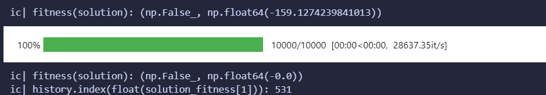
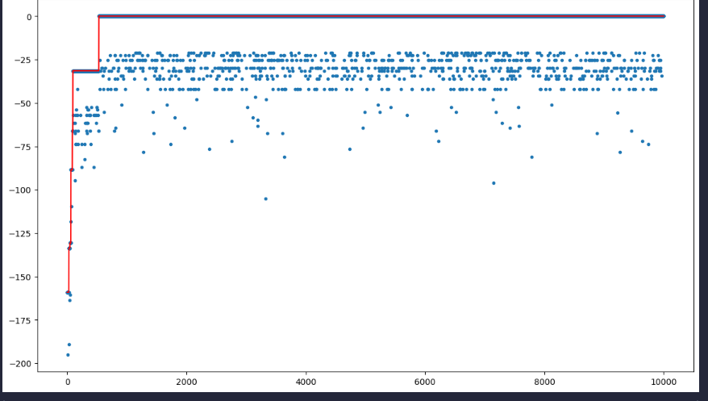
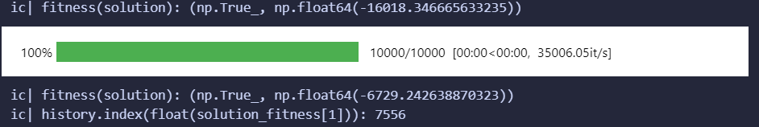
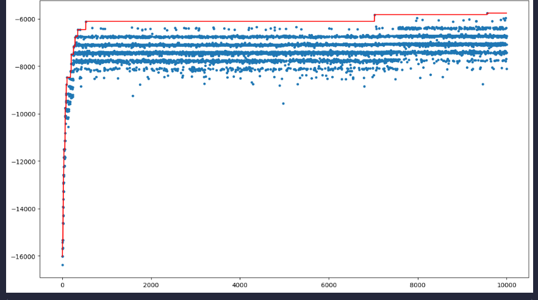
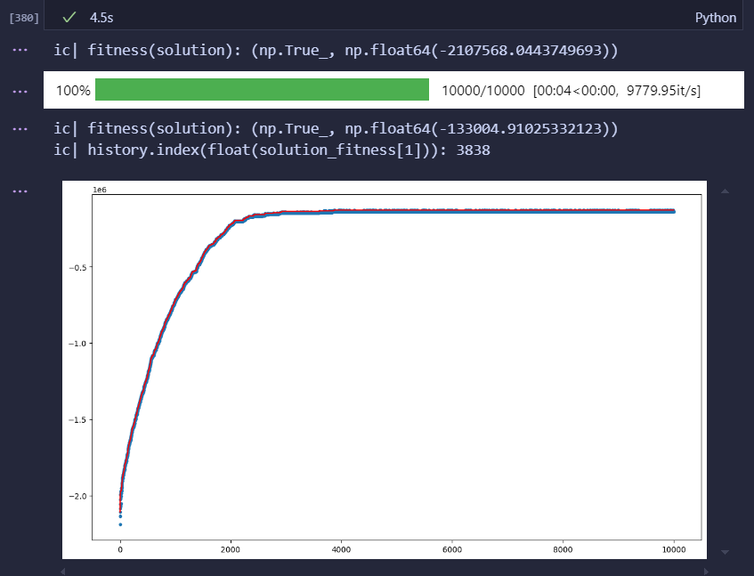
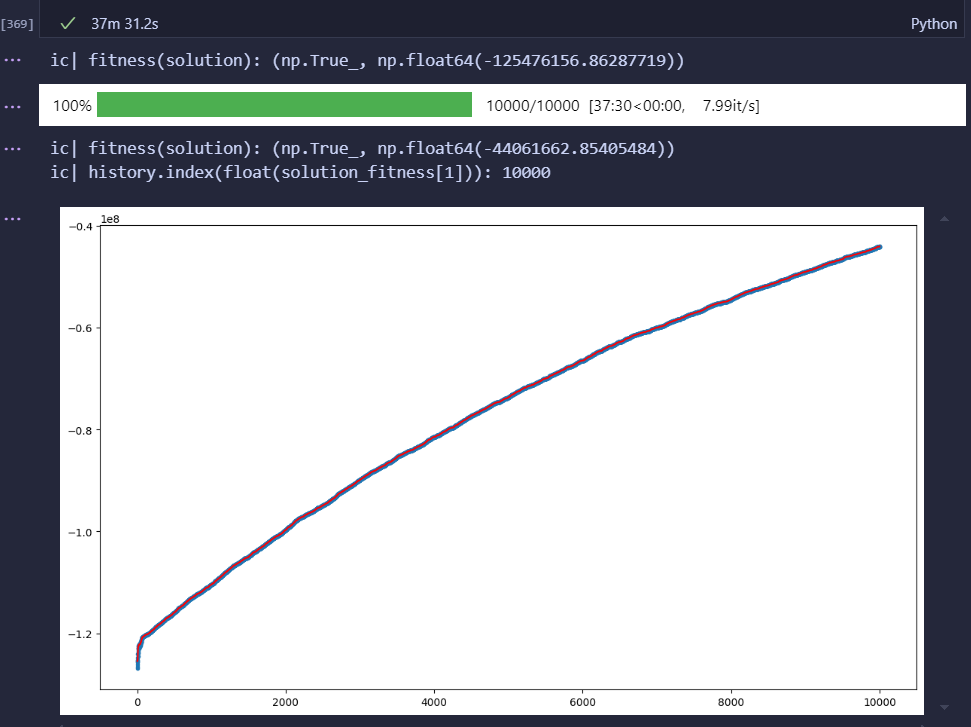
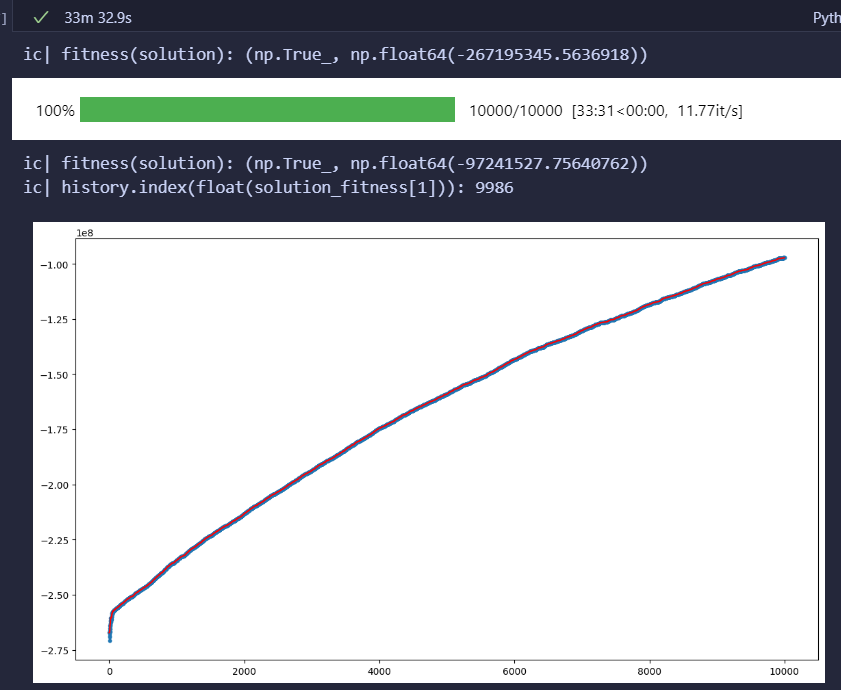
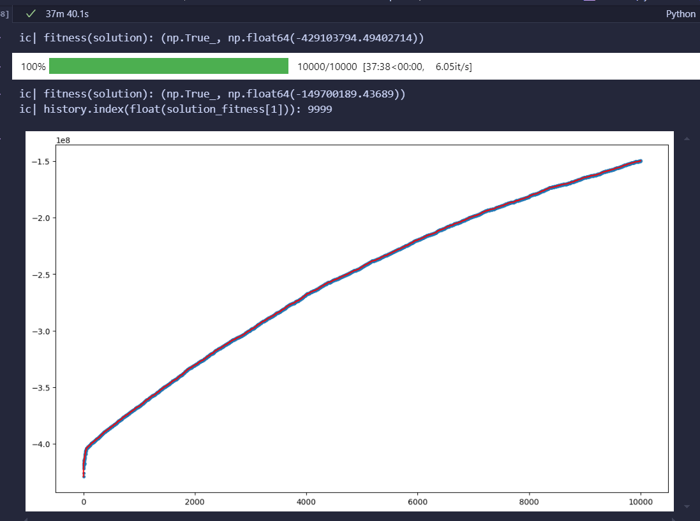

Computational Intelligence - Laboratory 1

I've used SIMPLE RHMC ALGORITHM  for the first two instances
and SELF ADAPTIVE ALGORITHM for the others

## 1) Universe size = 100, sets number = 10, density = 0.2

## 2) Universe size = 1.000, sets number = 100, density = 0.2

## 3) Universe size = 10.000, sets number = 1.000, density = 0.2

## 4) Universe size = 100.000, sets number = 10.000, density = 0.1

## 5) Universe size = 100.000, sets number = 10.000, density = 0.2

## 6) Universe size = 100.000, sets number = 10.000, density = 0.3

the lab was carried out with Lorenzo De Rosa  (329169) 
